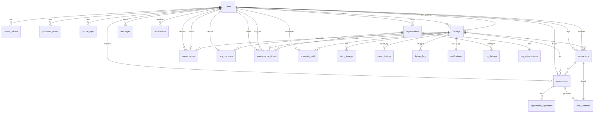
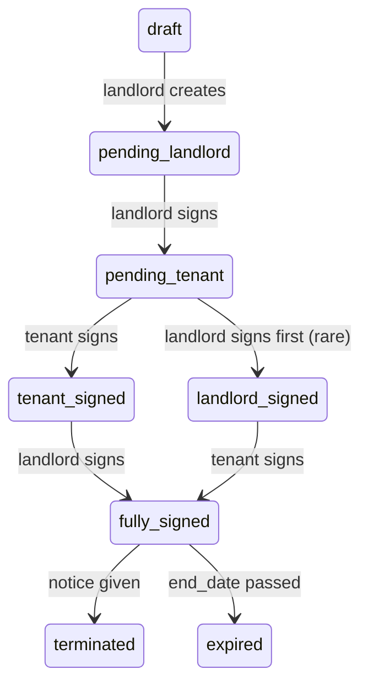

# PROPATI — Database Schema Reference

**Version:** 1.0  
**Source:** `oldpropati/BACKEND_STRUCTURE.md`  
**Database:** PostgreSQL 15.x on Supabase (UK region)  
**Connection:** `DATABASE_URL` → pooler `aws-0-eu-west-2.pooler.supabase.com:5432`

---

## 1. Schema Overview



**Total Tables:** 24 (22 core + 2 auxiliary)  
**Total Indexes:** 11 (explicit) + PK/FK implicit  
**ID Prefixes:** 8 conventions (`usr_`, `lst_`, `cnv_`, `msg_`, `agr_`, `txn_`, `org_`, `tkt_`)

---

## 2. Table Reference

### 2.1 Core Authentication (4 tables)

#### `users` — Primary Identity Table
```sql
CREATE TABLE users (
  id              TEXT PRIMARY KEY,           -- 'usr_' + 16 chars
  email           TEXT UNIQUE NOT NULL,
  phone           TEXT UNIQUE,
  password        TEXT NOT NULL,              -- bcrypt cost 12
  role            TEXT NOT NULL CHECK IN ('landlord','tenant','agent','admin','estate_manager'),
  full_name       TEXT NOT NULL,
  avatar_url      TEXT,
  -- NIN/BVN Encryption (AES-256-GCM)
  nin_encrypted   TEXT,                       -- encrypted value + IV + auth tag (JSON)
  nin_hash        TEXT,                       -- HMAC-SHA256 for deduplication lookup
  nin_verified    BOOLEAN DEFAULT FALSE,
  bvn_encrypted   TEXT,                       -- same format as nin_encrypted
  id_type         TEXT CHECK IN ('nin','bvn','passport','drivers_licence','voters_card'),
  id_number_enc   TEXT,                       -- encrypted ID number
  id_verified     BOOLEAN DEFAULT FALSE,
  id_doc_url      TEXT,                       -- Cloudinary URL for ID document
  phone_verified  BOOLEAN DEFAULT FALSE,
  -- Tenant Screening Profile
  employment_status TEXT CHECK IN ('employed','self_employed','business_owner','student','retired','unemployed'),
  employment_type   TEXT CHECK IN ('full_time','part_time','contract','freelance','internship'),
  employer_name     TEXT,
  job_title         TEXT,
  yearly_income     BIGINT,                    -- stored in kobo, encrypted conceptually
  income_verified   BOOLEAN DEFAULT FALSE,
  profile_bio       TEXT,
  profile_completed BOOLEAN DEFAULT FALSE,
  guarantor_name    TEXT,
  guarantor_phone   TEXT,
  guarantor_relationship TEXT,
  -- Status Flags
  is_active       BOOLEAN DEFAULT TRUE,
  is_banned       BOOLEAN DEFAULT FALSE,
  ban_reason      TEXT,
  -- Agent Specific
  agent_tier      TEXT DEFAULT 'standard' CHECK IN ('standard','senior','probation'),
  agent_approved  BOOLEAN DEFAULT FALSE,
  agent_bio       TEXT,
  agent_areas     JSONB,                       -- ["Lekki", "Ikeja", "Victoria Island"]
  -- Timestamps
  created_at      TIMESTAMPTZ DEFAULT NOW(),
  updated_at      TIMESTAMPTZ DEFAULT NOW(),
  last_login      TIMESTAMPTZ
);
CREATE INDEX idx_users_email ON users(email);
CREATE INDEX idx_users_nin_hash ON users(nin_hash);
```

**Key Design Decisions:**
- `TEXT` primary keys with prefix — enables log correlation, sharding-ready
- NIN/BVN stored **encrypted (AES-256-GCM)** — Nigeria Data Protection Regulation compliant
- `nin_hash` (HMAC-SHA256) enables *deduplication* without decrypting
- `agent_areas` as JSONB — flexible array of service areas
- `yearly_income` in kobo — integer math, no floating point errors

---

#### `refresh_tokens` — JWT Refresh Token Store
```sql
CREATE TABLE refresh_tokens (
  id           TEXT PRIMARY KEY,              -- 'rft_' + 16 chars
  user_id      TEXT REFERENCES users(id) ON DELETE CASCADE,
  token_hash   TEXT NOT NULL,                 -- bcrypt cost 8
  expires_at   TIMESTAMPTZ NOT NULL,          -- 7 days from issue
  created_at   TIMESTAMPTZ DEFAULT NOW()
);
```
**Security:** Only hash stored. Rotation: on refresh, old token deleted, new issued.

---

#### `password_resets` — Password Reset Tokens
```sql
CREATE TABLE password_resets (
  id           TEXT PRIMARY KEY,              -- 'pwd_' + 16 chars
  user_id      TEXT UNIQUE REFERENCES users(id) ON DELETE CASCADE,
  token_hash   TEXT NOT NULL,                 -- bcrypt cost 8
  expires_at   TIMESTAMPTZ NOT NULL,          -- 1 hour
  created_at   TIMESTAMPTZ DEFAULT NOW()
);
```
**Unique on user_id** — one active reset per user.

---

#### `phone_otps` — 6-Digit OTP (WhatsApp/SMS)
```sql
CREATE TABLE phone_otps (
  id           TEXT PRIMARY KEY,              -- 'otp_' + 16 chars
  user_id      TEXT REFERENCES users(id) ON DELETE CASCADE,
  otp_hash     TEXT NOT NULL,                 -- bcrypt cost 8
  expires_at   TIMESTAMPTZ NOT NULL,          -- 10 minutes
  created_at   TIMESTAMPTZ DEFAULT NOW()
);
```
**Rate limited:** 3 requests/hour per user via API middleware.

---

### 2.2 Listings & Verification (6 tables)

#### `listings` — Property Listings
```sql
CREATE TABLE listings (
  id                   TEXT PRIMARY KEY,       -- 'lst_' + 12 chars
  owner_id             TEXT REFERENCES users(id),
  agent_id             TEXT REFERENCES users(id),
  title                TEXT NOT NULL,
  description          TEXT,
  listing_type         TEXT NOT NULL CHECK IN ('rent','sale','short-let','share','commercial'),
  property_type        TEXT CHECK IN ('apartment','house','duplex','land','office','shop','warehouse'),
  address              TEXT NOT NULL,
  area                 TEXT NOT NULL,          -- e.g., "Lekki Phase 1"
  state                TEXT DEFAULT 'Lagos',
  price                NUMERIC NOT NULL,       -- in Naira (not kobo for display)
  price_period         TEXT CHECK IN ('night','month','year','total'),
  caution_deposit      NUMERIC,
  service_charge       NUMERIC,
  bedrooms             INT,
  bathrooms            INT,
  toilets              INT,
  size_sqm             NUMERIC,
  floor_level          INT,
  furnished            BOOLEAN DEFAULT FALSE,
  parking_spaces       INT DEFAULT 0,
  amenities            JSONB,                  -- ["AC", "Generator", "Pool", "Security"]
  available_from       DATE,
  minimum_stay         INT,                    -- for short-let (nights)
  status               TEXT DEFAULT 'draft' CHECK IN ('draft','active','suspended','deleted'),
  verification_tier    TEXT DEFAULT 'basic' CHECK IN ('basic','verified','inspected','certified'),
  is_featured          BOOLEAN DEFAULT FALSE,
  views_count          INT DEFAULT 0,
  created_at           TIMESTAMPTZ DEFAULT NOW(),
  updated_at           TIMESTAMPTZ DEFAULT NOW()
);
CREATE INDEX idx_listings_owner ON listings(owner_id);
CREATE INDEX idx_listings_status ON listings(status);
CREATE INDEX idx_listings_type ON listings(listing_type);
CREATE INDEX idx_listings_area ON listings(area);
```

**Search Query Pattern:**
```sql
SELECT * FROM listings 
WHERE status = 'active' 
  AND ($1::text IS NULL OR listing_type = $1)
  AND ($2::text IS NULL OR property_type = $2)
  AND ($3::text IS NULL OR area ILIKE '%' || $3 || '%')
  AND ($4::numeric IS NULL OR price >= $4)
  AND ($5::numeric IS NULL OR price <= $5)
  AND ($6::int IS NULL OR bedrooms >= $6)
  AND ($7::text IS NULL OR verification_tier = $7)
ORDER BY 
  CASE WHEN $8 = 'newest' THEN created_at END DESC,
  CASE WHEN $8 = 'price_asc' THEN price END ASC,
  CASE WHEN $8 = 'price_desc' THEN price END DESC,
  CASE WHEN $8 = 'most_verified' THEN 
    CASE verification_tier 
      WHEN 'certified' THEN 4 
      WHEN 'inspected' THEN 3 
      WHEN 'verified' THEN 2 
      ELSE 1 END 
  END DESC
LIMIT $9 OFFSET $10;
```

---

#### `listing_images` — Cloudinary Images
```sql
CREATE TABLE listing_images (
  id           TEXT PRIMARY KEY,              -- 'img_' + 12 chars
  listing_id   TEXT REFERENCES listings(id) ON DELETE CASCADE,
  url          TEXT NOT NULL,                  -- Cloudinary secure_url
  public_id    TEXT,                           -- for deletion: "propati/images/abc123"
  is_cover     BOOLEAN DEFAULT FALSE,
  sort_order   INT DEFAULT 0,
  created_at   TIMESTAMPTZ DEFAULT NOW()
);
```
**Limit:** 10 images per listing enforced in application logic.

---

#### `saved_listings` — User Favourites
```sql
CREATE TABLE saved_listings (
  id           TEXT PRIMARY KEY,              -- 'sav_' + 12 chars
  user_id      TEXT REFERENCES users(id) ON DELETE CASCADE,
  listing_id   TEXT REFERENCES listings(id) ON DELETE CASCADE,
  created_at   TIMESTAMPTZ DEFAULT NOW(),
  UNIQUE (user_id, listing_id)
);
```

---

#### `listing_flags` — Community Fraud Reporting
```sql
CREATE TABLE listing_flags (
  id           TEXT PRIMARY KEY,              -- 'flg_' + 12 chars
  listing_id   TEXT REFERENCES listings(id) ON DELETE CASCADE,
  flagged_by   TEXT REFERENCES users(id),
  type         TEXT CHECK IN ('fraud','duplicate','misleading','wrong_price','harassment','other'),
  description  TEXT,
  status       TEXT DEFAULT 'open' CHECK IN ('open','reviewed','dismissed'),
  created_at   TIMESTAMPTZ DEFAULT NOW()
);
```
**Auto-suspend:** 10+ open flags → `listings.status = 'suspended'` (cron job).

---

#### `verifications` — 5-Layer Verification State Machine
```sql
CREATE TABLE verifications (
  id                TEXT PRIMARY KEY,         -- 'ver_' + 12 chars
  listing_id        TEXT UNIQUE REFERENCES listings(id) ON DELETE CASCADE,
  owner_id          TEXT REFERENCES users(id),
  -- Layer 1: Documents
  l1_status         TEXT DEFAULT 'pending' CHECK IN ('pending','approved','rejected'),
  l1_doc_url        TEXT,                     -- Cloudinary folder: propati/documents/
  l1_submitted_at   TIMESTAMPTZ,
  -- Layer 2: Identity Match
  l2_status         TEXT DEFAULT 'pending' CHECK IN ('pending','approved','rejected'),
  l2_id_type        TEXT,                     -- 'nin' | 'bvn'
  l2_verified_at    TIMESTAMPTZ,
  -- Layer 3: Live Video
  l3_status         TEXT DEFAULT 'pending' CHECK IN ('pending','approved','rejected'),
  l3_video_url      TEXT,
  l3_qr_code        TEXT,                     -- unique per user
  -- Layer 4: Physical Inspection
  l4_status         TEXT DEFAULT 'pending' CHECK IN ('pending','approved','rejected'),
  l4_agent_id       TEXT REFERENCES users(id), -- PROPATI agent
  l4_scheduled_at   TIMESTAMPTZ,
  l4_completed_at   TIMESTAMPTZ,
  l4_report_url     TEXT,
  -- Layer 5: Admin Certification
  l5_status         TEXT DEFAULT 'pending' CHECK IN ('pending','approved','rejected'),
  current_layer     INT DEFAULT 1,            -- 1-5
  overall_status    TEXT DEFAULT 'not_started' CHECK IN ('not_started','in_progress','certified','rejected'),
  admin_notes       TEXT,
  reviewed_by       TEXT REFERENCES users(id),
  reviewed_at       TIMESTAMPTZ,
  updated_at        TIMESTAMPTZ DEFAULT NOW()
);
```

**State Transitions:**
| Current | Action | Next |
|---------|--------|------|
| `not_started` | submit_layer1 | `in_progress` (current_layer=1) |
| `in_progress` (L1) | admin_approve_l1 | current_layer=2 |
| `in_progress` (L2) | identity_confirmed | current_layer=3 |
| `in_progress` (L3) | admin_review_video | current_layer=4 |
| `in_progress` (L4) | inspection_done | current_layer=5 |
| `in_progress` (L5) | admin_grant_certified | `certified` |
| *any* | admin_reject | `rejected` |

---

### 2.3 Transactions & Agreements (6 tables)

#### `transactions` — Payment Records (Escrow Flow)
```sql
CREATE TABLE transactions (
  id               TEXT PRIMARY KEY,         -- 'txn_' + 12 chars
  reference        TEXT UNIQUE,              -- Paystack reference
  listing_id       TEXT REFERENCES listings(id),
  payer_id         TEXT REFERENCES users(id),
  payee_id         TEXT REFERENCES users(id),
  agent_id         TEXT REFERENCES users(id),
  type             TEXT CHECK IN ('rent','caution','sale','short_let','subscription'),
  status           TEXT CHECK IN ('pending','in_escrow','released','failed','refunded'),
  amount           BIGINT NOT NULL,           -- kobo (integer)
  platform_fee     BIGINT DEFAULT 0,         -- kobo
  agent_commission BIGINT DEFAULT 0,         -- kobo
  payee_amount     BIGINT,                   -- kobo (amount - fees)
  description      TEXT,
  paystack_data    JSONB,                    -- full webhook payload
  created_at       TIMESTAMPTZ DEFAULT NOW(),
  updated_at       TIMESTAMPTZ DEFAULT NOW()
);
```

**Fee Calculation (Application Logic):**
```javascript
const RATES = {
  rent: { platform: 0.10, agent: 0.10 },           // 10% platform, 10% of platform to agent
  sale: { platform: amount > 20_000_000 ? 0.02 : 0.01, agent: 0.015 },
  short_let: { platform: 0.10, agent: 0.10 },
  subscription: { platform: 0, agent: 0 }
};

function computeFees(type, amount, hasAgent) {
  const rate = RATES[type];
  const platform_fee = Math.round(amount * rate.platform);
  const agent_commission = hasAgent ? Math.round(platform_fee * rate.agent) : 0;
  const payee_amount = amount - platform_fee - agent_commission;
  return { platform_fee, agent_commission, payee_amount };
}
```

---

#### `agreements` — Digital Agreements
```sql
CREATE TABLE agreements (
  id                  TEXT PRIMARY KEY,         -- 'agr_' + 12 chars
  listing_id          TEXT REFERENCES listings(id),
  landlord_id         TEXT REFERENCES users(id),
  tenant_id           TEXT REFERENCES users(id),
  agent_id            TEXT REFERENCES users(id),
  type                TEXT CHECK IN ('rental','sale','short_let','share'),
  status              TEXT DEFAULT 'draft' CHECK IN ('draft','pending_landlord','pending_tenant','tenant_signed','landlord_signed','fully_signed','terminated','expired'),
  start_date          DATE,
  end_date            DATE,
  rent_amount         NUMERIC,
  rent_period         TEXT CHECK IN ('monthly','yearly'),
  caution_deposit     NUMERIC,
  service_charge      NUMERIC,
  notice_period_days  INT DEFAULT 30,
  special_clauses     TEXT,
  landlord_signed_at  TIMESTAMPTZ,
  tenant_signed_at    TIMESTAMPTZ,
  template_vars       JSONB,                    -- for PDF generation
  created_at          TIMESTAMPTZ DEFAULT NOW(),
  updated_at          TIMESTAMPTZ DEFAULT NOW()
);
```

**Status Machine:**


---

#### `agreement_signatures` — E-Signature Audit Trail
```sql
CREATE TABLE agreement_signatures (
  id              TEXT PRIMARY KEY,         -- 'sig_' + 12 chars
  agreement_id    TEXT REFERENCES agreements(id) ON DELETE CASCADE,
  signer_id       TEXT REFERENCES users(id),
  role            TEXT CHECK IN ('landlord','tenant','agent'),
  ip_address      TEXT,
  user_agent      TEXT,
  consent_text    TEXT,                     -- "I agree to the terms..."
  signed_at       TIMESTAMPTZ DEFAULT NOW(),
  checksum        TEXT                      -- SHA256(doc_url + signer_id + signed_at)
);
```

**Checksum Verification:**
```javascript
const checksum = crypto.createHash('sha256')
  .update(agreement.pdf_url + signer_id + signed_at.toISOString())
  .digest('hex');
```

---

#### `rent_schedule` — Recurring Rent Due Dates
```sql
CREATE TABLE rent_schedule (
  id               TEXT PRIMARY KEY,         -- 'rnt_' + 12 chars
  agreement_id     TEXT REFERENCES agreements(id) ON DELETE CASCADE,
  due_date         TEXT,                     -- 'YYYY-MM-DD' (string for easy JS)
  amount           NUMERIC,                  -- rent + service_charge
  status           TEXT DEFAULT 'upcoming' CHECK IN ('upcoming','paid','overdue'),
  paid_at          TIMESTAMPTZ,
  transaction_id   TEXT REFERENCES transactions(id),
  reminder_sent    INT DEFAULT 0             -- bitmask: 1=7days, 2=3days, 4=1day
);
```

**Generation (on agreement.fully_signed):**
```javascript
// Monthly from start_date to end_date
const months = differenceInMonths(end_date, start_date);
for (let i = 0; i <= months; i++) {
  const due = addMonths(start_date, i);
  await db.query(`
    INSERT INTO rent_schedule (id, agreement_id, due_date, amount)
    VALUES ($1, $2, $3, $4)
  `, [generateId('rnt_'), agreement_id, format(due, 'yyyy-MM-dd'), rent_amount + service_charge]);
}
```

---

### 2.4 Messaging (3 tables)

#### `conversations` — Idempotent Per Listing Pair
```sql
CREATE TABLE conversations (
  id                TEXT PRIMARY KEY,         -- 'cnv_' + 12 chars
  listing_id        TEXT REFERENCES listings(id) ON DELETE SET NULL,
  landlord_id       TEXT NOT NULL REFERENCES users(id),
  tenant_id         TEXT NOT NULL REFERENCES users(id),
  subject           TEXT,
  last_message      TEXT,
  last_message_at   TIMESTAMPTZ,
  unread_tenant     INT DEFAULT 0,
  unread_landlord   INT DEFAULT 0,
  status            TEXT DEFAULT 'active' CHECK IN ('active','archived','blocked'),
  created_at        TIMESTAMPTZ DEFAULT NOW(),
  updated_at        TIMESTAMPTZ DEFAULT NOW()
);
CREATE INDEX idx_conversations_landlord ON conversations(landlord_id);
CREATE INDEX idx_conversations_tenant ON conversations(tenant_id);
```

**Idempotent Creation:**
```sql
-- GET or CREATE
INSERT INTO conversations (id, listing_id, landlord_id, tenant_id, subject)
VALUES ($1, $2, $3, $4, $5)
ON CONFLICT (landlord_id, tenant_id, listing_id) DO NOTHING
RETURNING *;
```

---

#### `messages` — Polling-Based (4s)
```sql
CREATE TABLE messages (
  id               TEXT PRIMARY KEY,         -- 'msg_' + 12 chars
  conversation_id  TEXT NOT NULL REFERENCES conversations(id) ON DELETE CASCADE,
  sender_id        TEXT NOT NULL REFERENCES users(id),
  content          TEXT NOT NULL,
  attachment_url   TEXT,
  attachment_type  TEXT CHECK IN ('image','document','voice'),
  is_read          BOOLEAN DEFAULT FALSE,
  read_at          TIMESTAMPTZ,
  created_at       TIMESTAMPTZ DEFAULT NOW()
);
CREATE INDEX idx_messages_conv ON messages(conversation_id, created_at DESC);
CREATE INDEX idx_messages_sender ON messages(sender_id);
```

**Polling Query:**
```sql
SELECT * FROM messages 
WHERE conversation_id = $1 
  AND created_at > $2  -- since timestamp
ORDER BY created_at ASC;
```

---

#### `notifications` — In-App Notifications
```sql
CREATE TABLE notifications (
  id        TEXT PRIMARY KEY,                 -- 'not_' + 12 chars
  user_id   TEXT REFERENCES users(id) ON DELETE CASCADE,
  type      TEXT,                             -- 'rent_due', 'payment', 'message', 'verification', 'agreement'
  title     TEXT,
  body      TEXT,
  data      JSONB,                            -- { listing_id, agreement_id, ... }
  read      BOOLEAN DEFAULT FALSE,
  created_at TIMESTAMPTZ DEFAULT NOW()
);
CREATE INDEX idx_notifications_user ON notifications(user_id, read);
```

---

### 2.5 Organisations — B2B SaaS (5 tables)

#### `organisations` — Estate Management Companies
```sql
CREATE TABLE organisations (
  id                  TEXT PRIMARY KEY,         -- 'org_' + 12 chars
  name                TEXT NOT NULL,
  owner_id            TEXT REFERENCES users(id),
  billing_email       TEXT,
  address             TEXT,
  cac_number          TEXT,                     -- Corporate Affairs Commission
  plan_tier           TEXT DEFAULT 'starter' CHECK IN ('starter','growth','enterprise'),
  max_units           INT DEFAULT 20,
  max_seats           INT DEFAULT 1,
  paystack_customer_id TEXT,
  created_at          TIMESTAMPTZ DEFAULT NOW(),
  updated_at          TIMESTAMPTZ
);
```

**Plan Limits:**
| Tier | Monthly | Max Units | Max Seats |
|------|---------|-----------|-----------|
| Starter | ₦25,000 | 20 | 1 |
| Growth | ₦60,000 | 100 | 5 |
| Enterprise | ₦150,000 | Unlimited | Custom |

---

#### `org_members` — Team Seats
```sql
CREATE TABLE org_members (
  id           TEXT PRIMARY KEY,              -- 'mem_' + 12 chars
  org_id       TEXT REFERENCES organisations(id) ON DELETE CASCADE,
  user_id      TEXT REFERENCES users(id),
  email        TEXT,                           -- for pending invites
  role         TEXT CHECK IN ('manager','accountant','maintenance','owner_view'),
  status       TEXT DEFAULT 'pending' CHECK IN ('pending','active','removed'),
  invited_by   TEXT REFERENCES users(id),
  invite_token TEXT,                           -- for acceptance link
  joined_at    TIMESTAMPTZ,
  created_at   TIMESTAMPTZ DEFAULT NOW(),
  UNIQUE (org_id, user_id)
);
```

**Role Permissions:**
| Role | Portfolio | Ledger | Tickets | Team | Billing | Reports |
|------|-----------|--------|---------|------|---------|---------|
| Manager | RW | RW | RW | RW | R | R |
| Accountant | R | RW | R | R | RW | R |
| Maintenance | R | R | RW | R | — | — |
| Owner View | R | R | R | — | — | R |

---

#### `org_listings` — Org ↔ Listing Association
```sql
CREATE TABLE org_listings (
  id           TEXT PRIMARY KEY,
  org_id       TEXT REFERENCES organisations(id) ON DELETE CASCADE,
  listing_id   TEXT REFERENCES listings(id) ON DELETE CASCADE,
  created_at   TIMESTAMPTZ DEFAULT NOW(),
  UNIQUE (org_id, listing_id)
);
```

---

#### `maintenance_tickets` — Org Maintenance Workflow
```sql
CREATE TABLE maintenance_tickets (
  id             TEXT PRIMARY KEY,         -- 'tkt_' + 12 chars
  org_id         TEXT REFERENCES organisations(id),
  listing_id     TEXT REFERENCES listings(id),
  tenant_id      TEXT REFERENCES users(id),
  raised_by      TEXT REFERENCES users(id),
  title          TEXT NOT NULL,
  description    TEXT,
  category       TEXT CHECK IN ('plumbing','electrical','structural','security','cleaning','other'),
  priority       TEXT DEFAULT 'medium' CHECK IN ('low','medium','high','urgent'),
  status         TEXT DEFAULT 'open' CHECK IN ('open','assigned','in_progress','resolved','closed'),
  assigned_to    TEXT REFERENCES users(id),
  photo_urls     TEXT[],                   -- array of Cloudinary URLs
  resolution_note TEXT,
  resolved_at    TIMESTAMPTZ,
  closed_at      TIMESTAMPTZ,
  created_at     TIMESTAMPTZ DEFAULT NOW(),
  updated_at     TIMESTAMPTZ
);
```

---

#### `org_subscriptions` — Paystack Subscription Tracking
```sql
CREATE TABLE org_subscriptions (
  id                  TEXT PRIMARY KEY,
  org_id              TEXT REFERENCES organisations(id) ON DELETE CASCADE,
  paystack_sub_id     TEXT UNIQUE,
  plan                TEXT,
  status              TEXT DEFAULT 'active' CHECK IN ('active','paused','cancelled'),
  amount              BIGINT,               -- kobo
  current_period_start TIMESTAMPTZ,
  current_period_end   TIMESTAMPTZ,
  next_billing_date    TIMESTAMPTZ,
  created_at           TIMESTAMPTZ DEFAULT NOW()
);
```

---

### 2.6 Auxiliary Tables (2 tables)

#### `disputes` — Transaction Disputes
```sql
CREATE TABLE disputes (
  id           TEXT PRIMARY KEY,            -- 'dsp_' + 12 chars
  listing_id   TEXT REFERENCES listings(id),
  raised_by    TEXT REFERENCES users(id),
  type         TEXT,                        -- 'non_delivery', 'misrepresentation', 'refund', 'other'
  status       TEXT DEFAULT 'open' CHECK IN ('open','investigating','mediated','resolved','closed'),
  description  TEXT,
  resolution   TEXT,
  admin_id     TEXT REFERENCES users(id),
  created_at   TIMESTAMPTZ DEFAULT NOW(),
  resolved_at  TIMESTAMPTZ
);
```

---

#### `screening_calls` — Landlord-Tenant Screening Calls
```sql
CREATE TABLE screening_calls (
  id            TEXT PRIMARY KEY,           -- 'scr_' + 12 chars
  listing_id    TEXT REFERENCES listings(id),
  landlord_id   TEXT REFERENCES users(id),
  tenant_id     TEXT REFERENCES users(id),
  scheduled_at  TIMESTAMPTZ,
  status        TEXT DEFAULT 'scheduled' CHECK IN ('scheduled','completed','cancelled','no_show'),
  notes         TEXT,
  created_at    TIMESTAMPTZ DEFAULT NOW()
);
```

---

#### `email_log` — Email Audit Trail
```sql
CREATE TABLE email_log (
  id           TEXT PRIMARY KEY,            -- 'eml_' + 12 chars
  to_email     TEXT,
  subject      TEXT,
  status       TEXT CHECK IN ('sent','failed','bounced'),
  error        TEXT,
  created_at   TIMESTAMPTZ DEFAULT NOW()
);
```

---

## 3. Index Summary

| Index | Table | Columns | Purpose |
|-------|-------|---------|---------|
| `idx_users_email` | users | email | Login lookup |
| `idx_users_nin_hash` | users | nin_hash | NIN deduplication |
| `idx_listings_owner` | listings | owner_id | My listings |
| `idx_listings_status` | listings | status | Active filter |
| `idx_listings_type` | listings | listing_type | Type filter |
| `idx_listings_area` | listings | area | Area search |
| `idx_conversations_landlord` | conversations | landlord_id | Landlord inbox |
| `idx_conversations_tenant` | conversations | tenant_id | Tenant inbox |
| `idx_messages_conv` | messages | (conversation_id, created_at DESC) | Polling query |
| `idx_messages_sender` | messages | sender_id | Sent messages |
| `idx_notifications_user` | notifications | (user_id, read) | Notification badge |

**Implicit Indexes:** All PKs, FKs, and UNIQUE constraints

---

## 4. Migration History

| Migration | Description | Tables Affected |
|-----------|-------------|-----------------|
| `migrate_v1.js` | Initial schema (users, listings, auth) | 8 |
| `migrate_v2.js` | Verification, agreements, messages | +9 |
| `migrate_v3.js` | Organisations, tickets, subscriptions, fees | +9 |

**Current:** `migrate_v3.js` (24 tables)  
**Next:** `migrate_v4.js` — `applications` table (Phase 8)

---

## 5. Query Patterns Reference

### 5.1 Parameterized Queries Only
```javascript
// ALWAYS use $1, $2 placeholders
const res = await pool.query(
  'SELECT * FROM listings WHERE owner_id = $1 AND status = $2',
  [userId, 'active']
);

// NEVER: string concatenation
// BAD: `SELECT * FROM listings WHERE owner_id = '${userId}'`
```

### 5.2 Connection Pool
```javascript
// src/db/pool.js
const pool = new Pool({
  connectionString: process.env.DATABASE_URL,
  max: 20,
  idleTimeoutMillis: 30000,
  connectionTimeoutMillis: 5000,
});
```

### 5.3 Transaction Pattern
```javascript
const client = await pool.connect();
try {
  await client.query('BEGIN');
  await client.query('INSERT INTO agreements ...', [...]);
  await client.query('INSERT INTO agreement_signatures ...', [...]);
  await client.query('INSERT INTO rent_schedule ...', [...]);
  await client.query('COMMIT');
} catch (e) {
  await client.query('ROLLBACK');
  throw e;
} finally {
  client.release();
}
```

---

## 6. Data Integrity Rules

| Rule | Enforcement |
|------|-------------|
| CAC number unique per org | Application check (DB: unique not enforced) |
| 10 images max per listing | Application logic |
| Agent can only manage assigned listings | `listings.agent_id` FK + middleware |
| Tenant can only have 1 active conversation per listing | `UNIQUE (landlord_id, tenant_id, listing_id)` on conversations |
| Rent schedule generated only on `fully_signed` | Application trigger |
| Verification layers sequential | `current_layer` + status checks |
| NIN/BVN never in plaintext | AES-256-GCM encryption at rest |
| Refresh token rotation | Delete old on refresh |

---

## 7. Backup & Recovery

| Aspect | Config |
|--------|--------|
| **Provider** | Supabase (managed) |
| **Point-in-time Recovery** | 7 days (Supabase default) |
| **Backup Frequency** | Daily (managed) |
| **RPO** | < 1 hour |
| **RTO** | < 30 minutes |

---

*This schema reference is the authoritative source for all database interactions. Update `migrate_v4.js` for new columns/tables.*