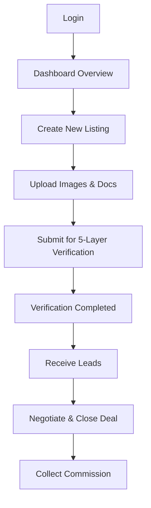
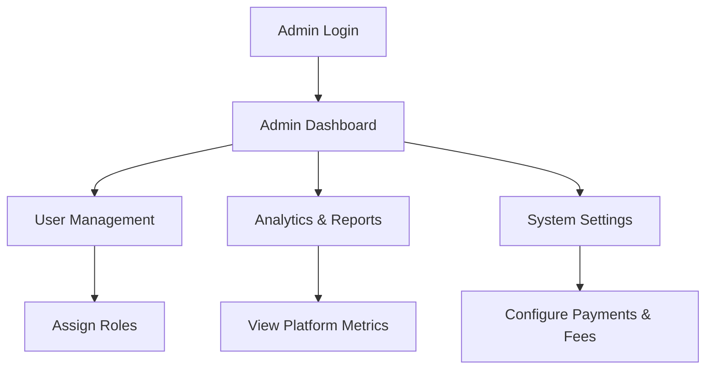

# User Journey Flows

## Overview
This document describes the end‑to‑end journeys for the five primary user roles in PROPATI:
- **Tenant**
- **Agent**
- **Admin**
- **Estate Manager**
- **Guest**

Each flow is expressed as a Mermaid diagram that can be rendered directly in the documentation site.

---
### 1️⃣ Tenant Journey
```mermaid
flowchart TD
    A[Visit Landing Page] --> B[Sign Up / Sign In (Clerk)]
    B --> C[Verify Identity (NIN via Prembly)]
    C --> D[Browse Listings]
    D --> E[Save Favorite]
    E --> F[Request Viewing]
    F --> G[Submit Application]
    G --> H[Pay Deposit (Paystack)]
    H --> I[Lease Agreement (PDF)]
    I --> J[Move‑In]
```

---
### 2️⃣ Agent Journey


---
### 3️⃣ Admin Journey


---
### 4️⃣ Estate Manager Journey
```mermaid
flowchart TD
    A[Login] --> B[Estate Portfolio]
    B --> C[Unit Management]
    C --> D[Rent Ledger]
    D --> E[Generate Invoices]
    E --> F[Collect Rent (Paystack)]
    F --> G[Maintenance Ticket System]
    G --> H[Assign Technician]
    H --> I[Close Ticket]
```

---
### 5️⃣ Guest Journey
```mermaid
flowchart TD
    A[Visit Landing Page] --> B[Browse Public Listings]
    B --> C[View Property Details]
    C --> D[Contact Agent (email/form)]
```

---
*All diagrams are rendered using Mermaid in the documentation site.*
